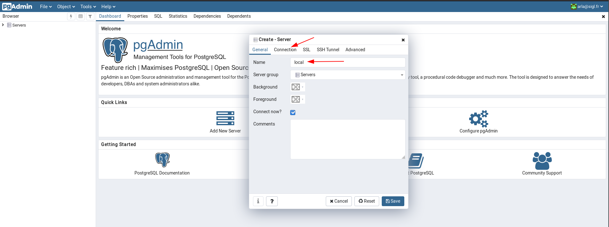
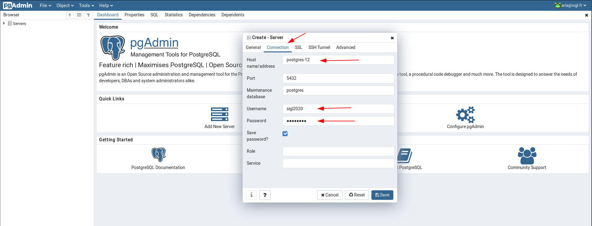
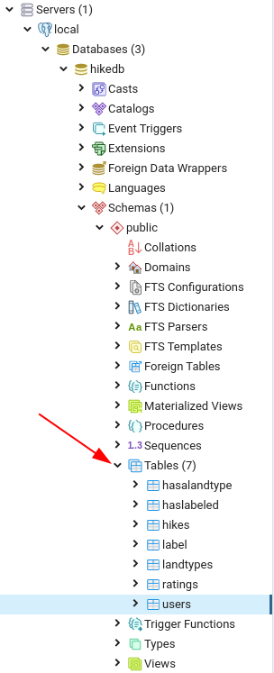

# PostgreSQL

PostgreSQL is a relationnal database system.

This is a development setup to play around with SQL.

## PgAdmin

PgAdmin is a simple web app providing a UI to manage your PostgreSQL.

## Start PostgreSQL and PgAdmin

Use the `docker-compose` file provided:

```bash
# Create a docker network for pgadmin to contact PostgreSQL
docker network create pgadmin
# Start both PostgreSQL and PgAdmin in background
docker-compose up -d
```

You should be able to access PgAdmin on http://localhost:8040/
- usermail: arla@sigl.fr
- password: sigl2020

For PostgreSQL instance running locally, credentials are:
- user: sigl2020
- password: sigl2020

Once logged in add the local PostgreSQL:
1. Add server
2. Enter a connection name (e.g. local)

3. Add the PostgreSQL containers info (user, password are both sigl2020)



## Create your database and your database schema

### Create your hikedb with PgAdmin

Go to your "local" server > right click > Create

Then name it "hikedb"

### Create your schema

From your terminal, execute:

```
# scripts are mounted as volume under /scripts
# test-data are mounted as volume under /test-data
docker exec postgres-12 psql -U sigl2020 -d hikedb -a -f /scripts/create-hike-database.sql
```

This will create the schema under "hikedb".

You can view your schema under Schema section:




## Use PosgreSQL CLI

> Note: You should have your `docker-compose`'s container up and running

If you wish to visualized your data directly using PostgreSQL CLI,
you can enter the PostgreSQL running container:

```bash
docker exec -it postgres-12 psql --username sigl2020 --password
# enter sigl2020 as password
# >
# Password: 
# psql (12.1)
# Type "help" for help.
# 
# sigl2020=# 
```

## Restarting PostgreSQL and PgAdmin

To restart without data loss:
```bash
docker-compose down
# ...
docker-compose up -d
```

To restart and wipe out all data:
```bash
docker-compose down
# remove data volumes, you might need sudo
rm -rf data pgadmin
# restart
docker-compose up -d
```
